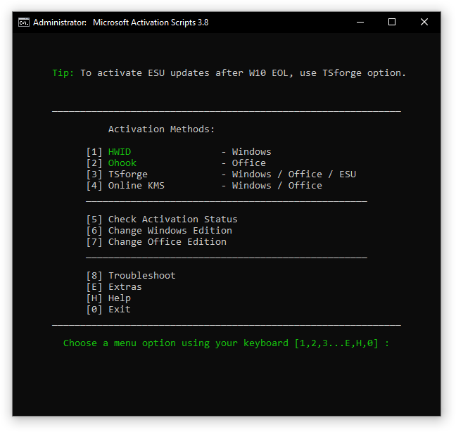

# 云之星DIY教程：使用 MAS 脚本一键激活 Windows 和 Office

## 简介
本教程直接指导如何操作，用于激活 Windows 10/11 系统或 Microsoft Office 软件。

### 第一步：打开 PowerShell（管理员模式）

1.  将鼠标移动到屏幕底部的 **Windows 徽标**（开始按钮）上。
2.  点击鼠标 **右键**。
3.  在弹出的菜单列表中，找到并点击 **Windows PowerShell (管理员)**。
    * *注意：如果你的系统是 Win11，可能显示为 **终端 (管理员)** 或 **Terminal (Admin)**，请点击它。*
4.  如果系统弹出“用户账户控制”提示框（问你是否允许更改），请点击 **“是”**。

### 第二步：输入激活命令

请在打开的蓝色或黑色命令行窗口中执行以下操作：

1.  **复制**下方任一代码（推荐首选代码）。
2.  回到命令行窗口，在空白处点击鼠标 **右键**（这会自动粘贴代码）。
3.  按键盘上的 **Enter (回车键)**。

**代码 1：英文原版（首选）**
```powershell
irm [https://get.activated.win](https://get.activated.win) | iex
```

**代码 2：中文汉化版（如果上方连接超时请用这个）**
```powershell
irm [https://gitee.com/cmontage/mas-cn/raw/main/GETMASCN.ps1](https://gitee.com/cmontage/mas-cn/raw/main/GETMASCN.ps1) | iex
```


### 第三步：在菜单中选择并执行激活

等待几秒钟，屏幕上会弹出一个新的菜单窗口（标题为 Microsoft Activation Scripts）。

请根据你的需求执行以下步骤：

#### 🟢 如果你要激活 Windows 系统

1.  看窗口中的菜单选项，找到 `[1] HWID` 或 `[1] HWID - Windows`.
2.  在键盘上按下数字键 **`1`**。
3.  该脚本会自动运行，请勿关闭窗口。
4.  观察屏幕文字，直到出现绿色的 **"Windows Permanently Activated"** 或 **"Windows 已永久激活"** 字样。
5.  按键盘上的 **任意键** 返回主菜单。

#### 🟢 如果你要激活 Office 软件

1.  看窗口中的菜单选项，找到 `[2] Ohook` 或 `[2] Ohook - Office`.
2.  在键盘上按下数字键 **`2`**。
3.  等待窗口显示 `[1] Install Ohook` 或类似的安装确认提示。
4.  在键盘上按下数字键 **`1`** 确认开始。
5.  等待脚本运行，直到出现绿色的 **"Office Permanently Activated"** 或 **"Office 已永久激活"** 字样。
6.  按键盘上的 **任意键** 返回主菜单。

#### 🔴 退出脚本
1.  确认所有激活都已完成。
2.  在主菜单界面，按下键盘数字键 **`0`** (Exit)。
3.  窗口会自动关闭。

## 备用方法：下载离线版（仅当上述方法报错时使用）

如果输入命令后一直报错无法连接，请按以下步骤操作：

1.  **下载文件**：
    * 点击下载中文版脚本：[下载链接](https://gitee.com/cmontage/mas-cn/releases/download/3.9.cn/MAS_AIO_CN_v3.9.cmd)
    * 或者下载英文版脚本：[下载链接](https://dev.azure.com/massgrave/Microsoft-Activation-Scripts/_apis/git/repositories/Microsoft-Activation-Scripts/items?path=/MAS/All-In-One-Version-KL/MAS_AIO.cmd&download=true)

2.  **运行脚本**：
    * 进入下载后的文件夹。
    * 找到后缀为 `.cmd` 的文件（例如 `MAS_AIO.cmd`）。
    * 鼠标右键点击该文件，选择 **“以管理员身份运行”**。
3.  **执行操作**：
    * 后续步骤与上文“第三步”完全一致（按 1 激活 Windows，按 2 激活 Office）。

## 最后一步：验证是否成功

### 检查 Windows
1.  点击 **开始菜单** -> **设置** (齿轮图标)。
2.  点击 **更新和安全** (Win10) 或 **系统** (Win11)。
3.  点击左侧或列表中的 **激活**。
4.  看“激活状态”一栏，显示 **“已使用数字许可证激活”** 即为成功。

### 检查 Office
1.  打开任意一个 Office 软件（例如 Word）。
2.  点击左上角的 **文件**。
3.  在左侧菜单底部点击 **账户** (Account)。
4.  在右侧“产品信息”下方，看到 **“产品已激活”** 即为成功。