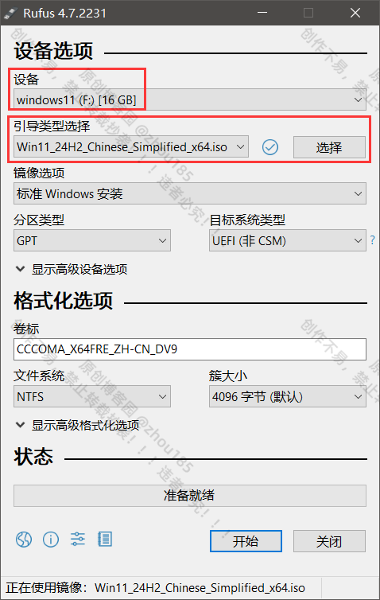
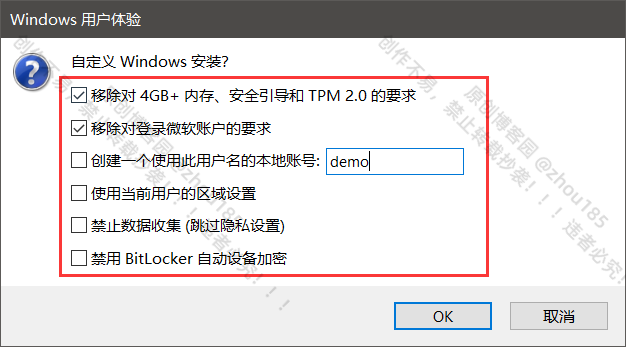
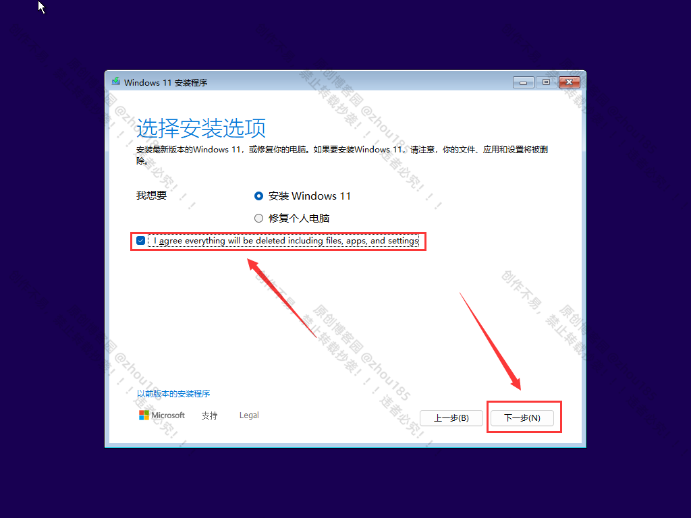

# 云之星DIY教程：U盘重装纯净版 Windows (Rufus + 官方镜像)

## ⚠️ 高能预警：前期准备

**重装系统会清空 C 盘（桌面、文档、下载等文件夹）的所有数据！**

1. **数据备份**：请务必将重要文件复制到移动硬盘或网盘。
2. **准备 U 盘**：这就需要一个 **8GB 以上** 的空 U 盘（制作启动盘会格式化 U 盘，里面的数据也会丢，请提前备份 U 盘资料）。
3. **下载网卡驱动 (关键)**：纯净版 Windows 安装后可能**没有网卡驱动**（导致无法连 WiFi）。
   * *建议*：去电脑品牌官网（如联想、戴尔官网）下载你机型的“无线网卡驱动”和“有线网卡驱动”，放在非 C 盘或另一个 U 盘里备用。

## 第一步：获取官方镜像 (ISO)

不要去第三方网站下载所谓的“装机版”，我们要用微软官方原版。

1. **Windows 11 下载**：访问 [微软官网 Windows 11 下载页](https://www.microsoft.com/zh-cn/software-download/windows11)。
2. 下拉找到 **“下载 Windows 11 磁盘映像 (ISO)”**。
3. 选择“Windows 11 (multi-edition ISO)”，语言选择“简体中文”，确认下载。

*(注：Windows 10 用户同理，搜索 "Windows 10 下载" 进微软官网即可)*

## 第二步：使用 Rufus 制作启动 U 盘

Rufus 是目前最好用的启动盘制作工具，免费、开源、无广告。

1. **下载 Rufus**：访问 [Rufus 官网 (rufus.ie)](https://rufus.ie/zh/) 下载最新便携版（后缀为portable）。
2. **插入 U 盘**，运行 Rufus。
3. **设置参数** (请仔细核对，**默认参数如下，无需做改动**)：
   * **设备**：选择你的 U 盘。
   * **引导类型选择**：点击右侧“选择”，找到刚才下载的 Windows ISO 镜像文件。
   * **分区类型**：通常选择 **GPT** (现在的电脑基本都是 UEFI 启动)。
   * **目标系统**：**UEFI (非 CSM)**。
   * 其他保持默认。
   
4. **开始制作**：
   * 点击“开始”。
   * **Win11 特有弹窗**：Rufus 会询问是否移除 4GB 内存限制、是否创建本地账户等。
   
     * *建议勾选*：全部勾选，以获得最佳兼容性。本地用户名处请注意*不要使用中文*，会导致各类兼容性问题，软件无法运行等。
   * 点击 OK，等待进度条跑完（显示“准备就绪”），拔出 U 盘。

> **🔍 推荐对照教程**：
https://www.cnblogs.com/zhou185/p/18899512

## 第三步：进入 BIOS 设置 U 盘启动

这是最难的一步，不同品牌电脑的按键不一样。

1. **关机**，插入制作好的 U 盘。
2. **开机**，并**疯狂断续点击**启动快捷键（不要长按，要像点击鼠标一样不停按），直到出现启动菜单 (Boot Menu)。

**常见品牌启动热键参考表：**
| 品牌 | 启动菜单热键 (Boot Menu) | 进 BIOS 热键 |
| :--- | :--- | :--- |
| **联想 (Lenovo)** | **F12** (或 Fn+F12) | F2 |
| **戴尔 (Dell)** | **F12** | F2 |
| **惠普 (HP)** | **F9** | F10 |
| **华硕 (ASUS)** | **F8** 或 **Esc** | F2 或 Del |
| **宏碁 (Acer)** | **F12** | F2 |
| **微星 (MSI)** | **F11** | Del |
| **组装台式机** | **F11** 或 **F12** | Del |

3. 在启动菜单中，选择带 **"USB"** 或 **"UEFI: [U盘品牌]"** 字样的选项，回车。

## 第四步：安装 Windows 系统

进入安装界面后，步骤如下：

1. **界面选择**：语言默认，点击“现在安装”。

2. **激活密钥**：点击底部的 **“我没有产品密钥”**（安装完用教程 2 激活）。
3. **版本选择**：推荐选择 **Windows 11 专业版** (Professional)。
4. **安装类型 (关键)**：选择 **“自定义：仅安装 Windows (高级)”**。
5. **分区操作 (数据毁灭时刻)**：
   * 你会看到很多分区（驱动器 0 分区 1, 2, 3...）。
   * 如果你是想**彻底重装**且已备份数据：选中这些分区，**一个个点击“删除”**，直到最后只剩下一个 **“驱动器 0 未分配的空间”**。
   * 选中这个“未分配的空间”，直接点击 **“下一步”**。
   * *系统会自动帮你新建必要的分区，无需手动操作。*
   
6. **等待重启**：电脑会自动安装并重启数次。
   * *注意：第一次重启黑屏时，就可以把 U 盘拔下来了，防止又进到 U 盘安装界面。*

## 第五步：收尾工作

1. **进入桌面**：按照提示设置区域、键盘。如果是用 Rufus 建立了本地账户，这步会很快。
2. **安装驱动**：如果发现没网，插入存有网卡驱动的 U 盘进行安装。
3. **激活系统**：参考 **电脑教程 (2)**。
4. **安装 Office**：参考 **电脑教程 (1)**。